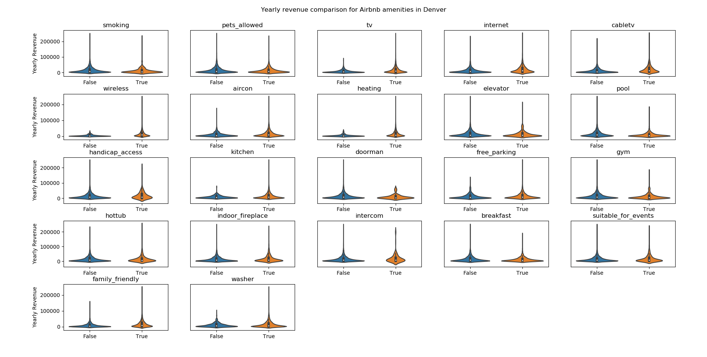

Variance inflation factors for bookings:

|  Variables         |   VIF          |
|:-------------------|---------------:|
| Unnamed: 0         |    1.058       |
| num_res            |    1.953       |
| airbnb_property_id |    7.785       |
| occ_rate           |   13.804       |
| revenue_potential  |   24.634       |
| days_b             |   84.55        |
| days_a             |  104.978       |
| days_r             |  126.696       |
| city_id            | 1463.55        |
| adr_native         |    1.254e+06   |
| adr                |    1.254e+06   |
| revenue            |    5.608e+06   |
| revenue_native     |    5.608e+06   |

Data imputation MSE:

|   Imputation Method  |    MSE         |
|:---------------------|---------------:|
| SimpleFill (mean)    | 2050.91        |
| 1KNN                 | 3942.8         |
| 2KNN                 | 2963.37        |
| 3KNN                 | 2592.96        |
| 4KNN                 | 2432.66        |
| 5KNN                 | 2332.15        |
| IterativeSVD        |    2.11556e+06 |
| MatrixFactorization | 2104.69        |

Vifs before feature selection (all of Denver)

|                      |         0 |
|:---------------------|----------:|
| breakfast            |     1.04  |
| pets_allowed         |     1.05  |
| longitude            |     1.052 |
| smoking              |     1.081 |
| intercom             |     1.103 |
| indoor_fireplace     |     1.103 |
| suitable_for_events  |     1.107 |
| wireless             |     1.118 |
| free_parking         |     1.125 |
| aircon               |     1.136 |
| handicap_access      |     1.138 |
| doorman              |     1.139 |
| heating              |     1.14  |
| kitchen              |     1.164 |
| internet             |     1.179 |
| family_friendly      |     1.183 |
| tv                   |     1.187 |
| cabletv              |     1.205 |
| hottub               |     1.42  |
| bathrooms            |     1.551 |
| pool                 |     1.888 |
| elevator             |     1.908 |
| gym                  |     2.143 |
| bedrooms             |     3.526 |
| accommodates         |     3.699 |
| dryer                |     7.674 |
| washer               |     7.675 |
| guidebook            |   nan     |

after:

|                      |         0 |
|:---------------------|----------:|
| breakfast            |     1.04  |
| pets_allowed         |     1.05  |
| longitude            |     1.052 |
| smoking              |     1.081 |
| indoor_fireplace     |     1.102 |
| intercom             |     1.103 |
| suitable_for_events  |     1.107 |
| wireless             |     1.116 |
| free_parking         |     1.125 |
| aircon               |     1.134 |
| handicap_access      |     1.138 |
| doorman              |     1.139 |
| heating              |     1.14  |
| kitchen              |     1.163 |
| internet             |     1.179 |
| family_friendly      |     1.183 |
| tv                   |     1.185 |
| washer               |     1.185 |
| cabletv              |     1.205 |
| hottub               |     1.42  |
| c_revenue_native_ltm |     1.515 |
| bathrooms            |     1.55  |
| pool                 |     1.887 |
| elevator             |     1.908 |
| gym                  |     2.143 |
| bedrooms             |     3.524 |
| accommodates         |     3.698 |

ElasticNet (l1 ratio = 1, epsilon = 0.001)
R^2 = 0.2618

|                     |         0 |
|:--------------------|----------:|
| pool                | -1576.91  |
| pets_allowed        | -1017.37  |
| suitable_for_events |  -761.282 |
| doorman             |  -701.459 |
| breakfast           |  -592.936 |
| indoor_fireplace    |  -134.433 |
| washer              |  -127.106 |
| handicap_access     |     0     |
| free_parking        |    -0     |
| kitchen             |    -0     |
| constant            |     0     |
| tv                  |     0     |
| smoking             |    -0     |
| gym                 |    59.6   |
| heating             |   175.392 |
| intercom            |   305.681 |
| wireless            |   591.156 |
| elevator            |   595.671 |
| family_friendly     |   676.562 |
| hottub              |   727.286 |
| aircon              |   757.886 |
| bathrooms           |  1119.92  |
| cabletv             |  2608.05  |
| internet            |  2712.64  |
| accommodates        |  9659.45  |
None

Standard linear regression:
0.2590

|                     |         0 |
|:--------------------|----------:|
| pool                | -1880.88  |
| pets_allowed        | -1110.54  |
| suitable_for_events |  -866.496 |
| doorman             |  -845.254 |
| breakfast           |  -697.207 |
| indoor_fireplace    |  -279.816 |
| washer              |  -266.462 |
| kitchen             |  -109.407 |
| handicap_access     |   -63.143 |
| free_parking        |   -26.873 |
| constant            |     0     |
| tv                  |    14.549 |
| smoking             |    27.328 |
| heating             |   253.956 |
| gym                 |   266.959 |
| intercom            |   405.442 |
| wireless            |   662.696 |
| elevator            |   695.705 |
| family_friendly     |   768.847 |
| aircon              |   838.895 |
| hottub              |   911.675 |
| bathrooms           |  1222.67  |
| cabletv             |  2665.65  |
| internet            |  2804.09  |
| accommodates        |  9729.23  |

Removing bathrooms and accommodates:

ElasticNet (l1 ratio = 1, alpha = 129.33)
r^2 = 0.1331

|                     |         0 |
|:--------------------|----------:|
| pool                | -2936.92  |
| pets_allowed        | -1096.61  |
| breakfast           | -1011.22  |
| doorman             |  -618.584 |
| smoking             |  -314.398 |
| gym                 |     0     |
| handicap_access     |     0     |
| elevator            |     0     |
| constant            |     0     |
| heating             |   172.856 |
| intercom            |   190.666 |
| free_parking        |   423.045 |
| wireless            |   432.563 |
| washer              |   460.173 |
| kitchen             |   652.922 |
| suitable_for_events |   695.309 |
| tv                  |   878.608 |
| indoor_fireplace    |  1035.44  |
| hottub              |  1336.98  |
| aircon              |  1422.26  |
| internet            |  2169.43  |
| cabletv             |  3624.64  |
| family_friendly     |  3691.5   |

standard linear regressions:
0.1315

|                     |         0 |
|:--------------------|----------:|
| pool                | -3278.2   |
| pets_allowed        | -1262.91  |
| breakfast           | -1171.62  |
| doorman             |  -773.915 |
| smoking             |  -448.95  |
| constant            |     0     |
| gym                 |     5.268 |
| handicap_access     |    56.803 |
| elevator            |   181.741 |
| heating             |   218.822 |
| intercom            |   285.8   |
| wireless            |   489.42  |
| washer              |   515.185 |
| free_parking        |   540.071 |
| kitchen             |   727.196 |
| suitable_for_events |   873.55  |
| tv                  |   912.621 |
| indoor_fireplace    |  1130.24  |
| aircon              |  1489.26  |
| hottub              |  1572.16  |
| internet            |  2226.67  |
| cabletv             |  3668.84  |
| family_friendly     |  3778.69  |

## Clustering:
To determine the most important features for an area, I created a script that takes the location (in latitude and longitude), bedrooms, bathrooms and # of people accommodated, and uses KNeighbors Regression to predict revenue with and without a particular amenity based on the most similar neighbors. The with-amenity predicition minus the without-amenity prediction is the revenue potential. I evaluated this for the most common amenities and put them in order of most potential.
Below is an example:

Select Program:
 1. Find best amenities
 2. Select amenity
1
Input information mode:
 1. Airbnb property ID
 2. Manual entry
1
ID: 6333040

|                     |   revenue_potential |
|:--------------------|--------------------:|
| pool                |            -49307   |
| elevator            |            -45468.8 |
| indoor_fireplace    |            -45453.1 |
| handicap_access     |            -42872.7 |
| breakfast           |            -42682.2 |
| suitable_for_events |            -42128   |
| smoking             |            -39603.1 |
| doorman             |            -38201.2 |
| free_parking        |            -34024.7 |
| intercom            |            -31131.7 |
| washer              |             34747.2 |
| pets_allowed        |             38157.4 |
| gym                 |             38711.1 |
| hottub              |             38744.3 |
| family_friendly     |             38852.5 |
| internet            |             39921.2 |
| aircon              |             43281.7 |
| kitchen             |             43807   |
| tv                  |             44031.3 |
| cabletv             |             44184.5 |
| heating             |             46322.4 |
| wireless            |             48728.7 |

imputation for full regression:

|                      |  RMSE  |
|:---------------------|-------:|
| 0SimpleFill          | 280706 |
| 7MatrixFactorization | 285061 |
| 5KNN                 | 299481 |
| 4KNN                 | 305361 |
| 3KNN                 | 313877 |
| 6IterativeSVD        | 327021 |
| 2KNN                 | 330045 |
| 1KNN                 | 371107 |

full regression:

ElasticNet R^2:  0.366

 Alpha:  10.210
 l1_ratio: 0.9

|                      |        0 |
|:---------------------|---------:|
| minimum_stay         | -778.961 |
| pool                 | -776.311 |
| response_time        | -747.262 |
| breakfast            | -474.507 |
| pets_allowed         | -400.918 |
| doorman              | -359.639 |
| business_ready       | -325.235 |
| monthly_discount     | -266.822 |
| gym                  | -183.147 |
| rating_value         | -162.263 |
| views_week           | -113.097 |
| smoking              |  -83.529 |
| rating_overall       |  -31.038 |
| constant             |    0     |
| elevator             |    7.544 |
| rating_checkin       |   14.638 |
| handicap_access      |  129.173 |
| heating              |  159.74  |
| hottub               |  201.427 |
| rating_location      |  221.482 |
| rating_communication |  226.625 |
| intercom             |  229.196 |
| suitable_for_events  |  231.23  |
| free_parking         |  250.608 |
| rating_accuracy      |  257.115 |
| washer               |  264.072 |
| indoor_fireplace     |  281.103 |
| wireless             |  281.477 |
| response_rate        |  287.539 |
| rating_cleanliness   |  288.045 |
| kitchen              |  304.136 |
| tv                   |  399.793 |
| weekly_discount      |  412.507 |
| aircon               |  485.118 |
| instant_book         |  903.478 |
| price_monthly        |  938.189 |
| price_weekly         |  952.7   |
| internet             | 1051.94  |
| family_friendly      | 1074.93  |
| cabletv              | 1418.97  |
| price_nightly        | 1796.42  |
| img_count            | 2114.96  |
| reviews_count        | 2658.07  |
| cleaning_fee         | 2854.74  |

Standard Linear R^2:  0.395

|                      |         0 |
|:---------------------|----------:|
| price_weekly         | -1931.6   |
| minimum_stay         | -1628.68  |
| pool                 | -1575.06  |
| response_time        | -1295.66  |
| monthly_discount     |  -972.535 |
| business_ready       |  -945.787 |
| pets_allowed         |  -814.912 |
| doorman              |  -789.618 |
| breakfast            |  -716.06  |
| views_week           |  -516.183 |
| rating_value         |  -459.514 |
| rating_checkin       |  -423.544 |
| rating_overall       |  -380.198 |
| response_rate        |  -222.671 |
| heating              |  -156.689 |
| gym                  |  -112.498 |
| tv                   |   -37.322 |
| constant             |     0     |
| handicap_access      |    39.642 |
| wireless             |    63.325 |
| indoor_fireplace     |    95.764 |
| smoking              |   149.03  |
| intercom             |   240.648 |
| free_parking         |   266.802 |
| rating_cleanliness   |   331.305 |
| suitable_for_events  |   333.531 |
| washer               |   347.172 |
| kitchen              |   379.95  |
| elevator             |   508.811 |
| rating_location      |   516.84  |
| rating_communication |   579.109 |
| aircon               |   625.528 |
| hottub               |   644.168 |
| rating_accuracy      |   709.644 |
| internet             |  1177.76  |
| family_friendly      |  1202.16  |
| instant_book         |  1389.4   |
| weekly_discount      |  1650.37  |
| price_monthly        |  1849.02  |
| cabletv              |  1995.15  |
| img_count            |  2707.27  |
| price_nightly        |  3646.2   |
| reviews_count        |  5697.2   |
| cleaning_fee         |  5811.96  |

VIFS before feature selection

|                      |         0 |
|:---------------------|----------:|
| business_ready       |     1.045 |
| breakfast            |     1.049 |
| views_week           |     1.054 |
| longitude            |     1.06  |
| pets_allowed         |     1.062 |
| minimum_stay         |     1.084 |
| smoking              |     1.106 |
| intercom             |     1.108 |
| indoor_fireplace     |     1.117 |
| suitable_for_events  |     1.126 |
| wireless             |     1.136 |
| free_parking         |     1.138 |
| handicap_access      |     1.144 |
| aircon               |     1.145 |
| heating              |     1.153 |
| doorman              |     1.159 |
| kitchen              |     1.171 |
| instant_book         |     1.173 |
| tv                   |     1.193 |
| washer               |     1.194 |
| family_friendly      |     1.2   |
| cabletv              |     1.228 |
| internet             |     1.362 |
| img_count            |     1.409 |
| hottub               |     1.429 |
| reviews_count        |     1.508 |
| bathrooms            |     1.586 |
| rating_location      |     1.606 |
| weekly_discount      |     1.626 |
| monthly_discount     |     1.685 |
| pool                 |     1.904 |
| c_revenue_native_ltm |     1.918 |
| elevator             |     1.968 |
| gym                  |     2.168 |
| response_rate        |     2.279 |
| rating_cleanliness   |     2.319 |
| response_time        |     2.428 |
| rating_overall       |     2.813 |
| rating_value         |     2.89  |
| rating_checkin       |     2.936 |
| cleaning_fee         |     3.134 |
| rating_accuracy      |     3.183 |
| rating_communication |     3.257 |
| bedrooms             |     3.755 |
| accommodates         |     4.035 |
| price_nightly        |    15.623 |
| price_monthly        |   140.13  |
| price_weekly         |   142.539 |
| latitude             | 50249.9   |

Further selection

|                     |       0 |
|:--------------------|--------:|
| business_ready      |   1.06  |
| intercom            |   1.136 |
| minimum_stay        |   1.161 |
| doorman             |   1.167 |
| handicap_access     |   1.176 |
| suitable_for_events |   1.215 |
| smoking             |   1.24  |
| breakfast           |   1.326 |
| pets_allowed        |   1.339 |
| indoor_fireplace    |   1.467 |
| hottub              |   1.561 |
| cabletv             |   1.79  |
| reviews_count       |   1.832 |
| internet            |   1.971 |
| pool                |   2.15  |
| instant_book        |   2.153 |
| elevator            |   2.279 |
| response_time       |   2.42  |
| gym                 |   2.509 |
| family_friendly     |   3.343 |
| price_nightly       |   3.381 |
| free_parking        |   4.195 |
| img_count           |   4.354 |
| cleaning_fee        |   5.187 |
| bathrooms           |   5.637 |
| weekly_discount     |   5.819 |
| aircon              |   5.87  |
| views_week          |   6.819 |
| washer              |   7.218 |
| bedrooms            |   7.643 |
| tv                  |   7.89  |
| kitchen             |  15.289 |
| wireless            |  27.624 |
| heating             |  39.047 |
| response_rate       |  82.807 |
| rating_overall      | 119.616 |

Standard Linear R^2:  0.393

|Feature              |   Coef    |
|:--------------------|----------:|
| minimum_stay        | -1697.57  |
| pool                | -1630.97  |
| response_time       | -1293.29  |
| business_ready      |  -931.101 |
| pets_allowed        |  -840.737 |
| doorman             |  -808.706 |
| breakfast           |  -748.002 |
| views_week          |  -515.668 |
| response_rate       |  -229.841 |
| heating             |  -154.873 |
| gym                 |   -31.646 |
| tv                  |   -24.007 |
| constant            |     0     |
| wireless            |    58.63  |
| handicap_access     |    74.541 |
| indoor_fireplace    |   136.79  |
| smoking             |   143.723 |
| intercom            |   247.692 |
| free_parking        |   250.801 |
| suitable_for_events |   306.72  |
| washer              |   328.707 |
| kitchen             |   355.635 |
| rating_overall      |   374.69  |
| elevator            |   579.366 |
| hottub              |   615.583 |
| aircon              |   626.635 |
| weekly_discount     |  1085.51  |
| internet            |  1193.2   |
| family_friendly     |  1233.78  |
| instant_book        |  1420.9   |
| cabletv             |  1967.28  |
| img_count           |  2762.98  |
| price_nightly       |  3583.5   |
| cleaning_fee        |  5751.4   |
| reviews_count       |  5774.19  |

a simple nlp(NOT TFIDF) / lasso regression on titles in denver showed the top words:
alpha = 12.489
r^2 = 0.2999
5br             20450.273794
mansion         20646.826391
firework        23340.979281
14              24806.870285
16++            25781.061027
16              27619.962822
group           27652.725589
3800            29184.224593
estate          29643.396534
sqft            35624.561128
dnvr            45114.833138
mediterranean   61570.619015
360             67152.592536
lowell          98599.500803
6br            101571.661425

(full data in nlp_title.pkl)

R^2 =  0.302
 Alpha:  41.616
party        5919.444465
hot          6045.517071
☆            6224.443167
chef         6322.019535
roof         6518.965178
4.5          6897.079489
standard     9123.732080
group        9586.668762
manage      11231.895177
dream       11919.766122
search      13177.088348
ping        17707.814759
reunion     32422.331226
('description_nontfidfmlp.pkl'

description LASSO with TFIDF, max_features = 100
R^2 =  0.155
 Alpha:  7.002
coors      11170.492524
fully      11273.700747
downtown   12282.654017
home       12412.314614
5          12510.719225
3          13055.777912
large      13196.214803
modern     19092.314708
high       19632.242715
family     21560.221761
spacious   22518.768666
'TFIDF_Description_max100.pkl'

title LASSO with TFIDF, max_features = 100
R^2 =  0.154
Alpha:  10.519

historic   10650.243343
modern     10792.298767
3          11809.194195
loft       11961.129650
large      12391.220199
oasis      12591.281021
remodel    13360.262421
deck       15890.755458
rooftop    16228.289341
luxury     20769.116204
sleep      44856.285094

title LASSO with TFIDF, max_features = 100
R^2 =  0.271
 Alpha:  5.206
u'room_darkening_shades                1.457288e+04
u'pocket_wifi                          1.597394e+04
entrance                               1.654987e+04
u'dishwasher                           1.795178e+04
u'lockbox                              1.833780e+04
u'smartlock                            2.128254e+04
u'paid_parking                         2.132096e+04
u'crib                                 2.173297e+04
u'wide_hallway_clearance               2.335660e+04
u'cable                                2.529066e+04
u'keypad                               2.608653e+04
u'pack_n_play_travel_crib              3.737685e+04
